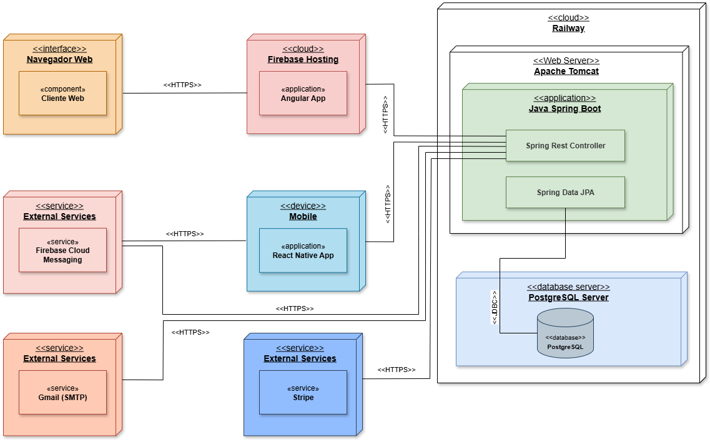

# Charrua Bus Frontend


---

## Tabla de Contenido

- [Charrua Bus Frontend](#charrua-bus-frontend)
  - [Tabla de Contenido](#tabla-de-contenido)
  - [Descripción](#descripción)
  - [Arquitectura](#arquitectura)
  - [Funciones Principales](#funciones-principales)
  - [Tecnologías](#tecnologías)
  - [Integraciones](#integraciones)
  - [Instalación](#instalación)
    - [Requisitos Previos](#requisitos-previos)
    - [Pasos](#pasos)
  - [Variables de Entorno](#variables-de-entorno)
  - [Ejecución](#ejecución)
  - [Estructura del Proyecto](#estructura-del-proyecto)

---

## Descripción

Este sistema fue desarrollado por el **Grupo 4** de la asignatura *Proyecto* del Tecnólogo en Informática (UTU – Sede Buceo, Montevideo, Uruguay).

**Charrua Bus** es una aplicación destinada a facilitar la compra de pasajes de ómnibus de larga distancia y la gestión operativa de la empresa. El **Frontend** provee una interfaz web responsiva que permite a los distintos roles (clientes, vendedores y administradores) interactuar con la plataforma de forma sencilla y segura.

## Arquitectura



* **Frontend** – Angular 19 + Angular Material.
* **Backend** – Java 21 / Spring Boot (repositorio aparte).
* **Base de Datos** – PostgreSQL 14

La comunicación con el backend se realiza mediante peticiones HTTP REST.

## Funciones Principales

| Rol | Funcionalidades |
|-----|-----------------|
| **Clientes** | • Búsqueda de viajes<br/>• Selección de asientos<br/>• Compra y cancelación de pasajes<br/>• Historial de compras |
| **Vendedores** | • Alta y reasignación de ómnibus<br/>• Planificación de mantenimientos<br/>• Gestión de devoluciones |
| **Administradores** | • Gestión de usuarios/roles<br/>• Configuración de parámetros del sistema<br/>• Paneles de estadísticas |

## Tecnologías

* Angular 19 + TypeScript
* Angular Material 17
* RxJS 7

## Integraciones

* **REST API Backend** – operaciones de negocio.

## Instalación

### Requisitos Previos

* Node.js ≥ 18.x
* npm ≥ 9.x
* Angular CLI ≥ 19.x

### Pasos

```bash
# 1. Clona el repositorio y entra al directorio
$ git clone <url-del-repo>
$ cd CharruaBusFrontend

# 2. Instala dependencias
$ npm install
```

## Variables de Entorno

Las variables específicas se encuentran en `src/environments/environment.ts`. En el mismo se puede cambiar la url dependiendo de el puerto en el que se ejecute el backend.

```ts
export const environment = {
  production: false,
  apiUrl: 'http://localhost:8080'
};
```

## Ejecución

| Entorno | Comando |
|---------|---------|
| **Desarrollo** | `npm start` ó `ng serve` |
| **Build producción** | `npm run build` (salida en `dist/charruabus-frontend/`) |

Tras iniciar el servidor de desarrollo:
* Aplicación: `http://localhost:4200`
* Backend (por separado): `http://localhost:8080`


## Estructura del Proyecto

```text
.
├── angular.json
├── firebase.json
├── package.json
├── proxy.conf.json
├── src/
│   ├── app/
│   │   ├── app.component.ts
│   │   ├── app.component.html
│   │   ├── component/
│   │   │   ├── buses-page/
│   │   │   ├── change-password/
│   │   │   ├── compra-page/
│   │   │   ├── localidades-page/
│   │   │   ├── viajes-page/
│   │   │   ├── users-page/
│   │   │   └── ...             # Otras páginas y diálogos
│   │   ├── core/
│   │   │   └── auth/           # Guards, interceptors, servicios de auth
│   │   ├── models/             # DTOs y enums compartidos
│   │   ├── services/           # Servicios para acceso a API
│   │   └── shared/             # Componentes reutilizables
│   ├── assets/                 # Imágenes y recursos estáticos
│   ├── environments/           # Configuraciones por entorno
│   ├── index.html
│   └── main.ts
└── README.md
```
